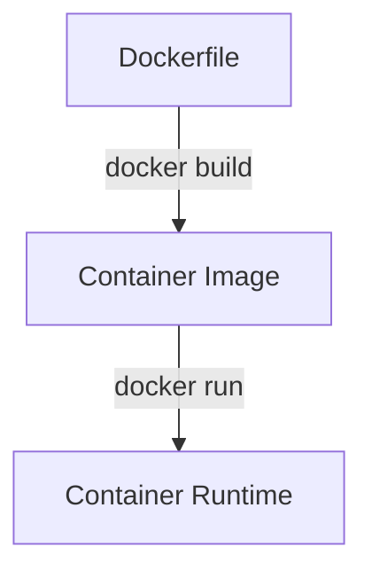

> [!info] Definition: Docker is an open source platform that enables developers to build, deploy, run, update and manage containers.

## Containers

Containers are standardized, executable components that combine application source code with OS libraries and dependencies required to run that code in any environment.

## Dockerfile

 Dockerfile is the source code for an image
  1. The dockerfile is parsed and generates LLB IR (low level builder)
  2. Buildkit then takes the LLB graph and executes it, finding optimal execution paths, caching and concurrent dependency resolution to build docker images. (platform dependent)
## Container Image

A container image is a standardized package that includes all of the files, binaries, libraries and configurations to run a container. (Immutable)

It is a blueprint for a container. It includes -
- A full root filesystem including all dependencies.
- Metadata for container runtime-
	- env
	- network ports
	- volumes
	- entrypoint to launch an instance of image
	- what user to start the program as
## Container Runtime

> [!info] Definition: A **container runtime** is a software responsible for creating container instances. It manages the lifecycle of containers on a host operating system by pulling images from a registry, starting and stopping containers, managing resources, providing network and storage integration.

- OCI : Open container Initiative is an open governance structure for the express purpose of creating open industry standards around container formats and runtimes.
- A container runtime is analogous to a JVM. The JVM runs bytecode, while a container runtime runs a container image.
	- JVM: Application level virtualization
	- Container runtime: OS-level virtualization; creates an isolated environment that shares the host OS kernel

> [!question] What happens when container runtime runs an image
> A separate namespace is created for each container instance
### How VMs differ from Containers

| Virtual machines                                                                       | Containers                                                                                                                    |
| :------------------------------------------------------------------------------------- | :---------------------------------------------------------------------------------------------------------------------------- |
| Create a virtual memory system and emulate the operating system to manage that memory. | Make use of the existing operating system and memory but isolate the binaries, libraries and applications (using namespaces). |
![[Pasted image 20260124193929.png]]

### Operating system features which make containerization possible

1. **Namespaces** (Silos for windows)
2. **Union file system** 
3. **Control groups** (Job objects for windows)

#### Namespaces

A process namespace is a Linux kernel feature that provides a process with a private, isolated view of system resources, such as process IDs, network stacks and mount points.

#### Union file system

Allows container runtime to efficiently manage multiple container instances, leading to significant savings in both disk space and memory.
- Image layer (lower, read only) : Every container instance reads from this layer. This layer is composed of multiple layers. Each layer represents a set of file system changes. (eg- installing a library, adding source code)
- Container layer (upper, mutable, unique): All the changes are made to this layer. (==non persistent==)

**Copy on Write (CoW) mechanism**
- When a container needs to modify a file, it is copied from image layer to the container layer and then changes are made to that unique file.

#### Control groups (cgroups)

- Linux kernel feature that limits and isolates the resource usage of a group of processes, organizing them into a hierarchical system.
- If we only use a namespace, then the process will believe that all the global resources are for itself.