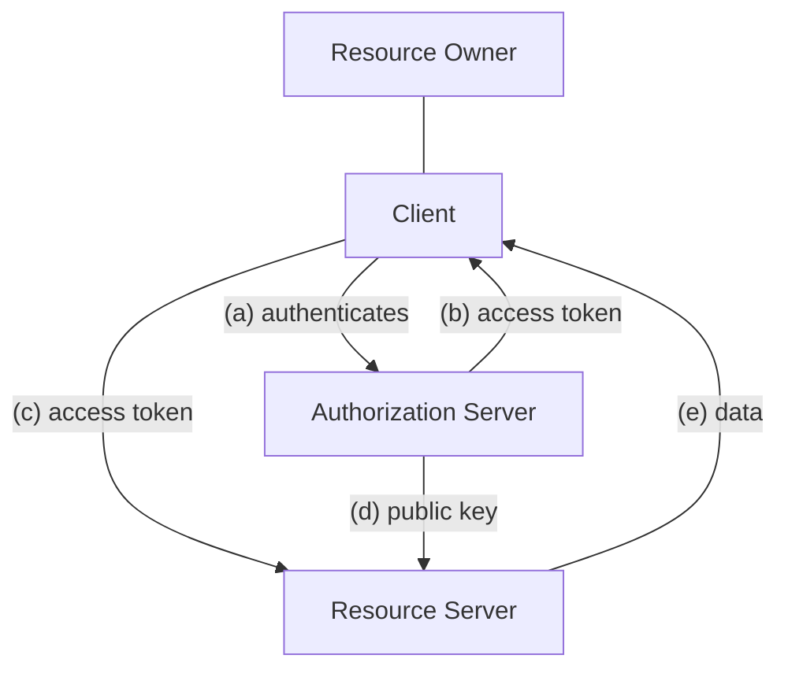

# OAuth 2.0 (Delegated Authorization)

## Definition
* An authorization framework letting users grant third-party apps limited access to their data on other services without sharing passwords.
* It uses **access tokens** for permission, not authentication itself.
* The access token is stateless and self contained

## Actors
1.  **Resource Owner (User):** Person who owns the account.
2.  **Resource Server:** Server that holds account data.
3.  **Authorization Server:** Handles authentication and authorization.
4.  **Client:** Application that requests access to the resource server on behalf of the resource owner.

## Diagram
# Delegated Authorization Flow

## Diagram

> [!note]  OAuth decouples the security from the system.

## Authorization vs. Authentication
* The authorization server is responsible for authentication and issuing access tokens.
*  The resource server receives the validated token, reads the userId and scopes, and then performs authorization. 
* **Verification:** When the resource server verifies the JWT, it is authenticating the **Authorization Server**, not the Resource Owner.
* OAuth does not govern the method of authentication used by the Auth Server.

## OAuth Flows
OAuth is a flexible framework providing ==different ways of retrieving access tokens:==
* [[Authorization Code Flow]]
* [[PKCE Flow]]
* [[Client Credentials Flow]]
* [[Resource Owner Password Flow]]

> [!caution] JWE can be used in place of JWS if the access token claims are sensitive