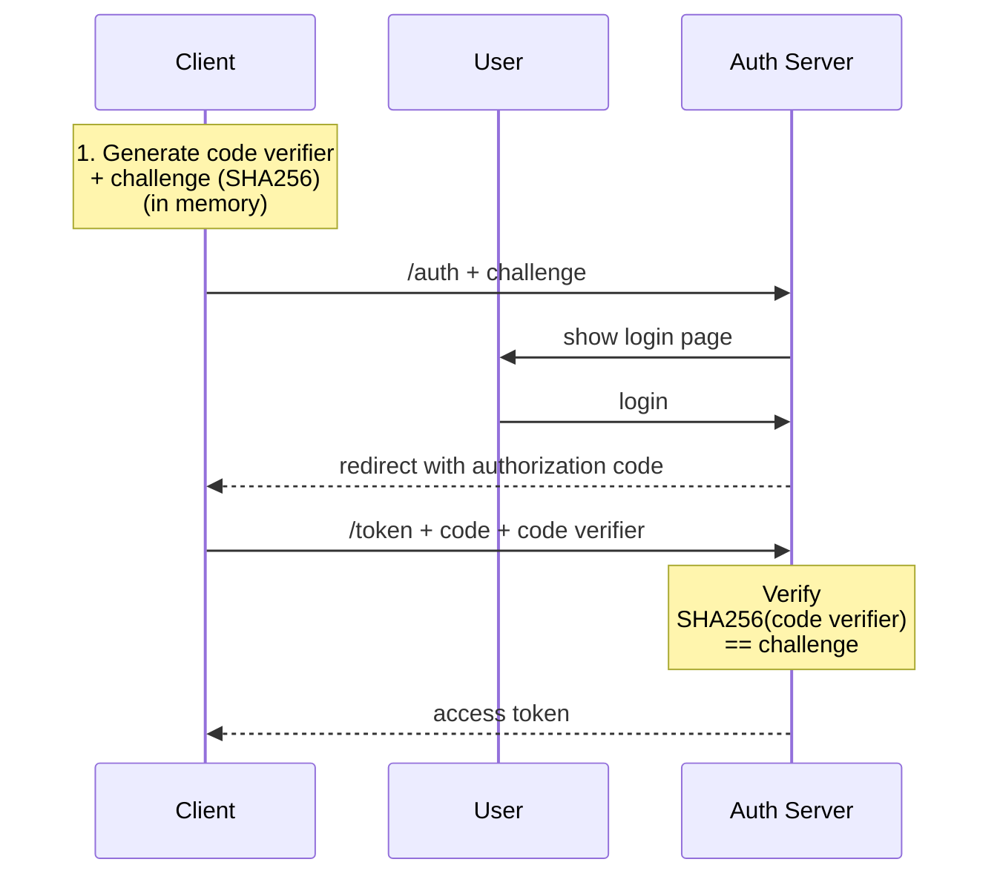

**Proof key for code exchange**

> [[Authorization Code Flow]]'s extension

## Problem statement

- The redirect from auth server to redirect_uri is passed to the operating system, instead of the targeted application. Any malicious software can intercept this and acquire the authorization code.
- Client secret cannot be stored safely in a frontend application. (private client)

## Solution

