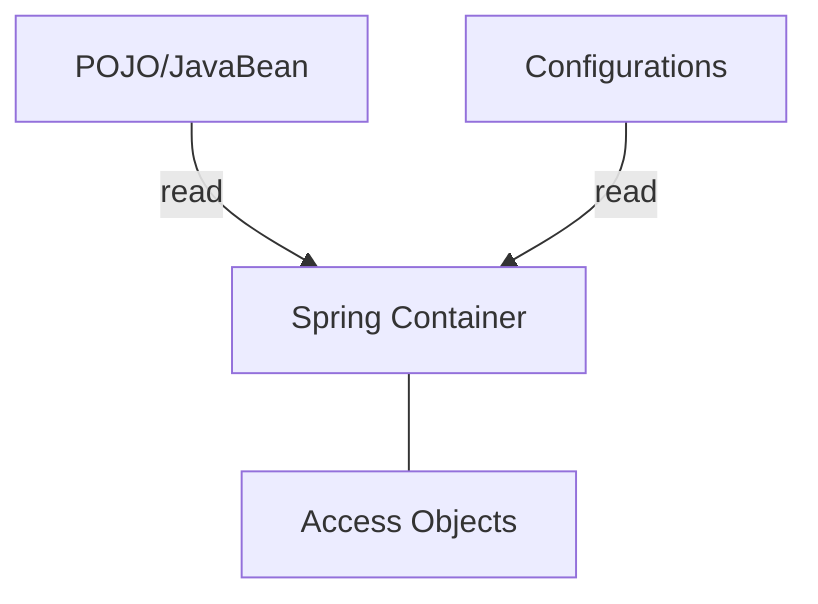
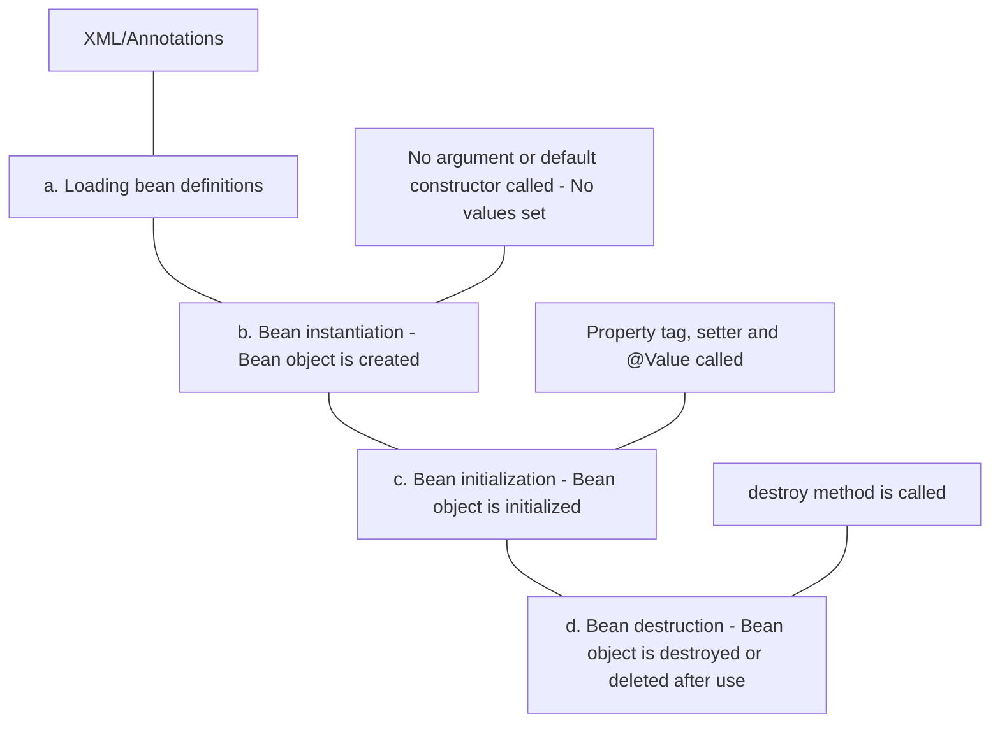

- Open source java framework
- We can develop standalone and enterprise apps

## Advantages of spring
1. Modular and lightweight
2. Flexible configuration
3. Dependency injection
4. Aspect oriented programming
5. Simplified database access
6. Testing support
7. Security
8. Integration capabilities
9. Scalability
10. Open source

## Spring container - Core component (heart) - IoC container

### Responsibilities

- Manage bean objects (creation, initialization, destruction)
- Manage bean life cycle
- Dependency Injection
- AOP
- Transaction management
- I18N (Internationalization)
- Integration
etc.

### Types
1. BeanFactory (old)
2. ApplicationContext (new) (interface) (invokes spring container)


### JavaBean class
It's a convention. It is a regular java class, except it follows some conventions -
1. All properties are private (use getters/setters)
2. A public no argument constructor
3. Implements serializable
Spring beans are singleton by default

### ApplicationContext (interface)
The ApplicationContext (spring container) is an interface in spring which is used to manage beans, handle application events, and access resources.
Some implemented classes are -
1. ClassPathXmlApplicationContext (Used for XML config)
2. AnnoationConfigApplicationContext (Used for java config)

## Bean life cycle



1. Loading Bean definitions -
	 Spring loads bean definitions from various sources, such as XML configuration files, java based configuration classes or component scanning
	 These bean definitions contain information about the bean class, dependencies and other configuration details.
2. Bean instantiation -
	 After bean definitions are loaded, the spring container creates instances of beans based on these definitions.
	 This involves invoking the bean class's constructor to create an actual instance of the bean.
3. Bean Post processor -
	 An interface that enables custom logic to be executed before and after the initialization of spring beans.
4. Bean initialization -
	 Once the bean is instantiated, spring proceeds to configure and initialize it. Property values are set using setters, constructor args, or field injection.

## Dependency Injection

1. It's a design pattern to achieve Inversion of Control (IoC)
2. It's main task is to "inject" the "dependency" - inject one object into another object.
3. It is used to achieve "loose coupling" 
4. We can achieve DI by 2 ways -
	 - Setter method DI
	 - Constructor DI

Instead of creating the object inside another object (hardcoding the dependency), we can insert it from outside using the constructor or setter methods. This way, we can decide to extend or switch the object using inherited or implemented classes.

Annotation @Autowired is used to achieve dependency injection.

- Setter method DI
```java

@Component
class Car{
	@Autowired
	private Engine engine;
}

@Component
class Engine{
}
```

- Constructor method DI
```java

@Component
class Car{
	private Engine engine;
	@Autowired
	public car(Engine engine){
		this.engine=engine;
	}
}

@Component
class Engine{
}
```

It is a good practice to use @Autowired on constructor of the object class because it
1. Promotes immutability
2. Easier to test
3. Guarantees dependency availability

The @Qualifier and @Primary annotation in spring helps pick the right bean among multiple beans of the same type. It helps spring to know which bean you want injected, resolving ambiguity.
