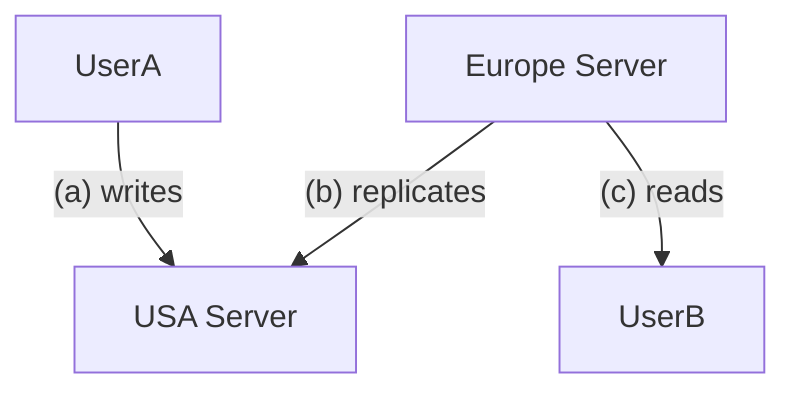

According to CAP theorem, you can only have 2 out the 3:
1. Consistency - All nodes/users see the same data at the same time
2. Availability - Every request gets a response (fresh or stale)
3. Partition tolerance - system works despite network failures between nodes (always needed)

- Important to decide early on during non-functional requirements
- Different parts of the system can have different requirements

>[!question] How to decide? 
>Ask yourself if your software requires strong consistency or not. (Consistency is exponentially hard to achieve than availability across distributed and scalable systems)

## Consistency or Availability

What the system does when network fails between two servers
1. STOP serving data (consistency)
2. RISK serving wrong/stale data (availability)

In case User B tries to read data which has not been replicated from the USA server yet, either it can be shown an error (consistency) or it can be shown the possibly stale data.

Distributed systems can be of different types -
1. Multiple master nodes and their replicas
2. Single master node and it's replicas

Multiple master nodes increases complexity exponentially and it is harder to handle the problems it creates involving data consistency and availability.

## Single master node databases

Let's try to solve this problem for single master node databases.

For single node databases with no replicas, consistency is always at 100% but their scalability only gets as high as vertical scaling allows. The database will only be able to handle a certain amount of reads and writes at any given time, hindering the availability of the system in case of system overload and it might even lead to data loss due to server crashing. 

Unlike stateless server applications, scaling availability of databases comes with a lot of challenges.
The replica nodes need to have separate memories in order to not corrupt the data since two nodes are unaware of each other's existence. Separate memories mean that the data from the master node has to be continuously replicated to the slave nodes. This is called database replication and it is a form of horizontal scaling. The master node is responsible for all the writes to the system. 

Database replication is perfect for scaling reads and for systems requiring high availability. However, the data is not guaranteed to be consistent depending on the replication and the health of the master node.

Database replication can be made consistent by following the synchronous replication strategy along with Two phase commit -  By default, database write transactions are completed once the data is stored by the master node, the replication takes place asynchronously. This can be a problem since it leaves the small gap between the completion of write and the replication of that data. The master node can also go down without any replication taking place. This is a serious hazard. Synchronous replication strategy means that a write transaction is only successful if it is written to the master and then replicated to all (for consistency) or at least one (for backup) of the slave nodes (this strategy comes with higher latency).

Synchronous replication by itself doesn't solve data inconsistency, it needs to be paired with MVCC across all nodes and two phase commit. This system maintains the atomicity across all nodes. In case any of the nodes fail to commit, all the nodes rollback the data. MVCC prevents dirty reads during this transaction.

> [!note] 
> Two phase commit is a form of ultimate pessimistic locking (see [[Database locks]])

Another strategy which is used for consistency in a replicated database is that the queries requiring consistency only read from the master node. The rest of the queries can go to all the other nodes. (This strategy does not prevent data loss in case the master goes down before replication)

Database sharding provides consistency and also scales reads and writes both. Sharding is mostly used together with database replication to prevent data loss. The same synchronous replication + 2PC strategy and master-reads strategy can be used in that case.

